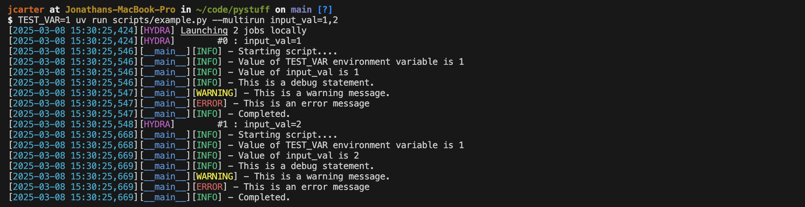
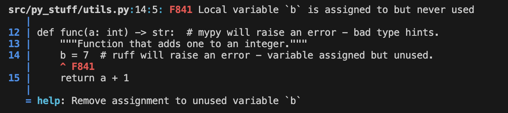
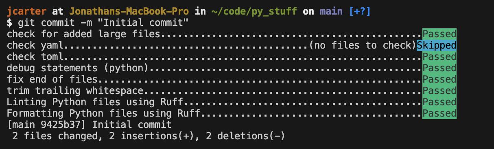

# Cookiecutter Research

A template repository with Python software development best practices and useful extensions for ML researchers:
- **uv** for Python dependency management.
- **ruff** for automatic code linting and formatting.
- **beartype** for runtime type-checking.
- **hydra** for experiment configuration.

Plus, Python development best practices like:
- An editable `src` package for your code.
- A `pyproject.toml` configuration file.
- Automatic **pre-commit** checks.
- Testing using the **pytest** framework.

## Updates

### 🔄 Migration to Copier (07-2025)

This template has been **migrated from Cookiecutter to Copier**! See below for more details.

## Getting started

### Prerequisites
If you haven't already, install **uv** on your machine by following the instructions [here](https://docs.astral.sh/uv/getting-started/installation/). You should then install [**copier**](https://github.com/copier-org/copier) and [**pre-commit**](https://pre-commit.com) by running:
```bash
uv tool install copier
uv tool install pre-commit
```

### Project generation
To generate a new project with name `your_new_project`, run:
```bash
uvx copier copy https://github.com/joncarter1/cookiecutter_research.git your_new_project --trust
```
This will initiate a dialog, enabling you to configure many options for the new repository, such as your name, a description of your project, and the version of Python to use. After entering these options, a new Git repository will be generated. Most individual files in the generated project contain in-line annotations detailing their responsibility and the meaning of various configuration options.

### Running scripts
The generated project contains a simple script that uses [Hydra](https://hydra.cc/) for configuration:



Scripts can import code developed within your Python package in the `src` folder. There is no need to mess with `sys.path` !

## Development

### Automatic code checks

Within the newly created repo, you should run:
```bash
uv run pre-commit install
```
This will configure a range of checks (configured in `.pre-commit-config.yaml`) that will run automatically whenever you run `git commit`.

The generated repository deliberately contains a small number of bugs in `broken_utils.py`, which have been introduced to highlight features of this repository, including type-checking, code linting, formatting and testing.

For example, **ruff** will automatically flag code quality issues:



Once you've fixed all the issues, re-run `git add` and `git commit` and all pre-commit checks should pass as below:



You can then `git push` your (hopefully) higher-quality code changes.

If you find the default linting and formatting rules of **ruff** too strict, it is simple to disable specific rules. See the `[tool.ruff.lint]` section of the generated `pyproject.toml` configuration file for an example of how to do this.

### Testing
Tests for generated projects should be stored under the `tests` folder and can be run with `uv run pytest`.

## Template structure

```bash
scripts/ 
    example.py # An example script.
    config/ # Folder to store Hydra configuration files.
src/ # Python package location for your project.
tests/ # Contains example tests using the Pytest framework.
.env # Used for storing env vars. Kept out of version control.
.editorconfig # Used to define code formatting conventions.
.pre-commit-config.yaml # Configures automatic checks that run before git commits.
.gitignore # Identifies file patterns to exclude from git.
pyproject.toml # Python project configuration file.
Dockerfile # Recipe for creating a Docker image for your project.
.dockerignore # Files to ignore when creating the Docker image.
```

## Credits
This template is powered by excellent tools like `uv` and `ruff` developed by [Astral](https://astral.sh/).

I'm grateful to Fran Boon (@flavour) for introducing me to the magic of project templating and many of the packages used in this repository.
